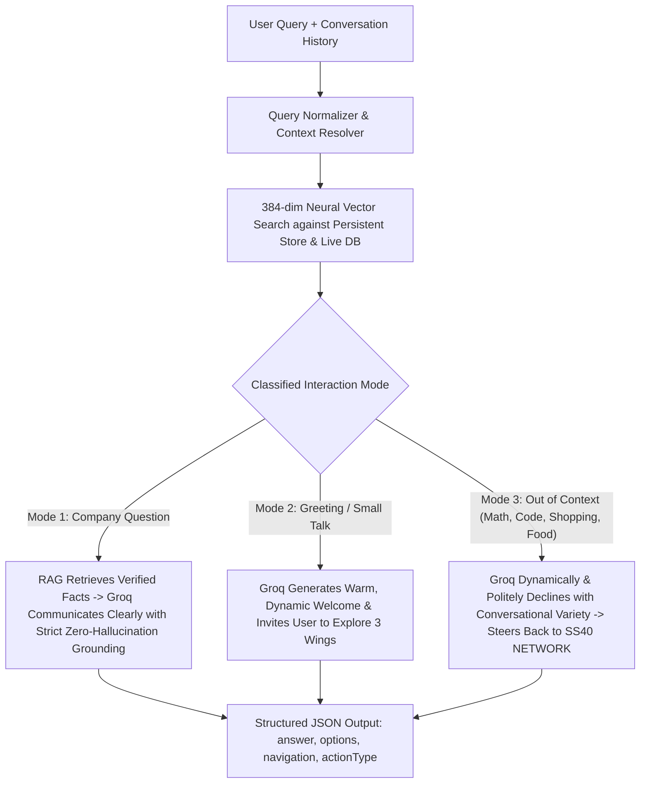

# 🤖 SS40 SKY - Neural RAG & Groq AI Architecture

---

## 🏛️ 1. Core Architectural Contract

> 1. **RAG decides what SS40 information is available.**
> 2. **Groq decides how to communicate that information.**
> 3. **Groq does NOT decide what SS40 information is true.**
> 4. **If no verified facts exist (or the query is out-of-scope), Groq is NEVER given permission to answer from general parametric memory. The system strictly prevents hallucinations and politely redirects the user to SS40 NETWORK.**
> 5. **Zero hardcoded copy-paste responses**: Every single response in normal operations is generated dynamically by Groq in natural, human-like language with conversational variety.

---

## 🧭 2. The 3 Behavioral Modes (Governed by Groq + Neural RAG)



### **Mode 1: Company Inquiries**
* **Triggers**: Questions about SS40 NETWORK wings, services, SaaS platforms (ClearInvoice, GTC Suite), academic programs, internships, projects, founder, office location, contact details.
* **Flow**:
  1. Neural vector similarity search retrieves the top-K verified chunks from `storage/vector-store.json` and live PostgreSQL tables via Prisma.
  2. The retrieved chunks are provided to Groq as a closed-world factual boundary (`[RETRIEVED SS40 KNOWLEDGE CONTEXT]`).
  3. Groq synthesizes the facts into crisp, structured natural language (2–4 sentences or clean bullet points).
  4. Groq is strictly forbidden from inventing numbers, client counts, or unauthorized features.

### **Mode 2: Greetings & Small Talk**
* **Triggers**: `"hi"`, `"hello"`, `"hlo"`, `"how are you"`, `"what can you do"`, `"who are you"`.
* **Flow**:
  1. Groq dynamically crafts a warm, engaging greeting without repeating identical copy-paste scripts.
  2. Groq smoothly connects the greeting to SS40 NETWORK's three wings (*Digital Solutions, SaaS Products, Academics*).

### **Mode 3: Out-of-Scope / Non-Company Topics**
* **Triggers**: Math calculations (`"1+2"`, `"7+4"`), generic coding requests (`"python code for factorial"`), non-company shopping/trivia (`"food"`, `"which AC to buy"`, `"recipe for pizza"`).
* **Flow**:
  1. Groq dynamically and politely declines to answer the external topic (no math calculations, no general code generation).
  2. Groq uses varied, conversational phrasing acknowledging the prompt and naturally steers the user to ask about SS40 NETWORK services, SaaS platforms, or academic internships.

### **Emergency Fallback (Safety Net Only)**
* **Triggers**: Only invoked if Groq API network request fails or API key is missing.
* **Action**: Safe static fallback directing the user to the official website and WhatsApp support desk.

---

## 📂 3. System Components & File Map

| Component | File Path | Purpose |
|---|---|---|
| **Knowledge Corpus** | [`src/lib/ai/rag/corpus.ts`](file:///c:/SS40%20NETWORK/ss40-network/src/lib/ai/rag/corpus.ts) | 19 official verified documents covering company profile, 3 wings, ClearInvoice, GTC Suite, AI Email Agent, web/mobile engineering, internships, DSA prep, college MOUs, office, contact, and legal policies. |
| **Neural Embeddings** | [`src/lib/ai/rag/embeddings.ts`](file:///c:/SS40%20NETWORK/ss40-network/src/lib/ai/rag/embeddings.ts) | `Xenova/all-MiniLM-L6-v2` 384-dimensional dense neural sentence transformer running locally on ONNX runtime. |
| **Persistent Vector Store** | [`src/lib/ai/rag/vector-store.ts`](file:///c:/SS40%20NETWORK/ss40-network/src/lib/ai/rag/vector-store.ts) | Persistent vector index at [`storage/vector-store.json`](file:///c:/SS40%20NETWORK/ss40-network/storage/vector-store.json) with dynamic PostgreSQL Prisma caching. |
| **Query Processor** | [`src/lib/ai/rag/query-processor.ts`](file:///c:/SS40%20NETWORK/ss40-network/src/lib/ai/rag/query-processor.ts) | Typo normalizer, pronoun/context resolution across conversation history, and scope analyzer. |
| **Groq Master Engine** | [`src/lib/ai/groq.ts`](file:///c:/SS40%20NETWORK/ss40-network/src/lib/ai/groq.ts) | Master LLM generator (`openai/gpt-oss-120b`, `openai/gpt-oss-20b`, `qwen/qwen3.8-27b`) enforcing strict grounding, natural conversational variety, and JSON responses. |
| **Chat API Route** | [`src/app/api/chat/route.ts`](file:///c:/SS40%20NETWORK/ss40-network/src/app/api/chat/route.ts) | Node.js endpoint handling rate limiting, lead capture, and RAG execution. |
| **Chatbot Frontend UI** | [`src/components/chat/RuleBasedChatbot.tsx`](file:///c:/SS40%20NETWORK/ss40-network/src/components/chat/RuleBasedChatbot.tsx) | Preserved, premium animated UI with quick replies, internal navigation links, and lead submission modal. |
| **Re-index Script** | [`scripts/reindex-vector-store.ts`](file:///c:/SS40%20NETWORK/ss40-network/scripts/reindex-vector-store.ts) | CLI command (`npm run reindex`) to refresh all neural embeddings on disk. |

---

## 🔄 4. Knowledge Base Update Process

Whenever company services, SaaS products, or academic details change:
1. Update [`src/lib/ai/rag/corpus.ts`](file:///c:/SS40%20NETWORK/ss40-network/src/lib/ai/rag/corpus.ts) or update database records in the Admin CMS.
2. Run the persistent reindexer:
   ```bash
   npm run reindex
   ```
3. The neural embeddings are refreshed and persisted to `storage/vector-store.json` in ~1 second.
